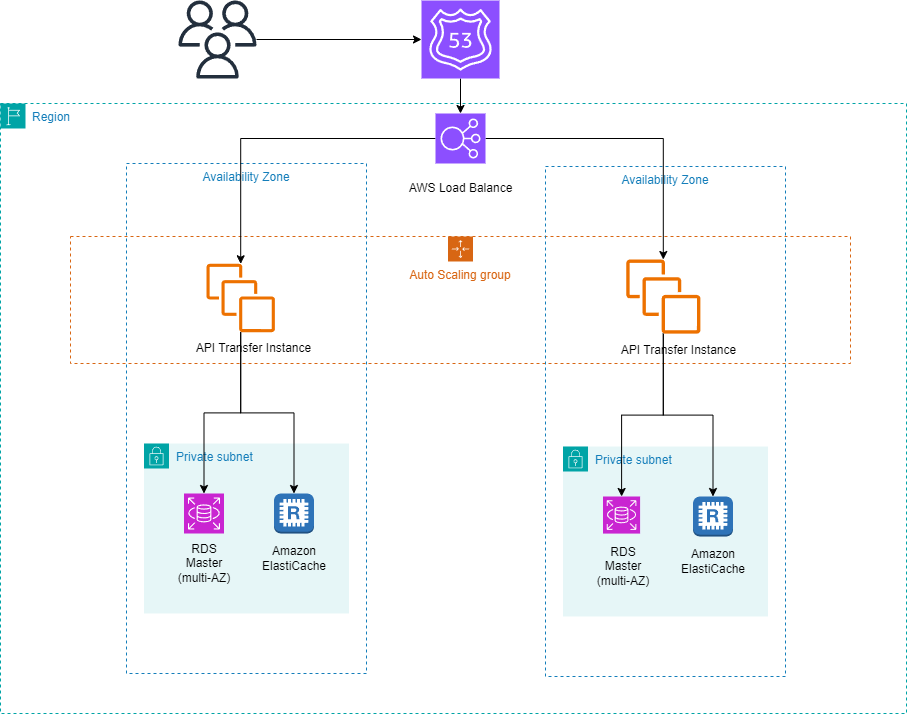

# README #

Esse projeto foi desenvolvido para o processo seletivo de Engenheiro de Software Itaú.

### Principais Tecnologias utilizadas ###

* Java 17
* Intellij.
* Spring FrameWork 3.2.4.
* PostgreSql.
* Redis.

### Docker Compose ###

Executar o Docker Compose que se encontra na pasta raiz desse projeto para subir um ambiente local de REDIS e POSTGRES. Pode ser utilizado o VS CODE.

### Disponibilidade e Escalabilidade ###

Arquitetura escalável utilizando serviços AWS para atender às necessidades de crescimento dinâmico e gestão eficiente de tráfego. Esta solução foca em alta disponibilidade, segurança e escalabilidade, empregando as melhores práticas e as tecnologias mais modernas do mercado.

#### 1. Amazon Elastic Kubernetes Service (EKS): ####
Configuração do Amazon EKS, um serviço gerenciado que facilita a operação do Kubernetes na AWS, eliminando a necessidade de instalar ou operar sua própria infraestrutura de orquestração de contêineres. O EKS é ideal para sistemas que exigem alta disponibilidade e escalabilidade automática.

#### 2. Load Balancers (ALB): ####
Configuração do Application Load Balancers (ALB) para gerenciar o tráfego HTTP/HTTPS, garantindo que as cargas sejam distribuídas de maneira eficiente entre os pods e instâncias. Esse passo é crucial para manter a performance e a disponibilidade, mesmo durante picos de acesso.

#### 3. Auto Scaling Groups (ASG): ####
Configuração de grupos de Auto Scaling para ajustar o número de instâncias EC2 automaticamente, baseando-se em critérios predefinidos como uso de CPU e memória. Essa configuração assegura que sempre haverá recursos computacionais adequados disponíveis, otimizando custos e performance.

#### 4. Monitoramento e Segurança: #### 
Utilizar o AWS CloudWatch para monitorar continuamente as métricas de desempenho e logs de sistema.

#### Diagrama proposto: ####

### Divisão de Pastas do Projeto ###

O projeto está dividido nas seguintes pastas:

* config: Contendo a configuração inicial do projeto.
* constants: Contendo as variáveis e constantes do projeto.
* controller: Contendo a camada controller do projeto.
* exceptions: Contendo os exceptions e o handler do projeto.
* gateway: Contendo a camada de conexão com Apis externas.
* model: Contendo os objetos modal do projeto.
* repository: Contendo a camada de banco de dados do projeto.
* service: Contendo a camada de services do projeto.

### Arquitetura SOLID ###

O projeto está arquitetado respeitando algumas das principais regras do SOLID, que sÃo:

* Princípio da Responsabilidade Única: Os services estão segregados por responsabilidade única, assim como as camadas de serviço, banco de dados, controladora e gateway.
* Princípio Aberto-Fechado: As classes estão seguindo o princípio de "Aberto-Fechado", pois como elas estão utilzando as interfaces de acesso, é possível criar várias implementações para uma mesma interface. 
* Princípio da Segregação da Interface: As classes estão seguindo o princípio de "SegregraçÃo de Interfaces" pois como todo o acesso as camadas é feito pelas interfaces, é possível criar interfaces específicas para situações específicas.

### Padrões de Projeto ###

O projeto possui alguns dos principais padrões de projeto como o Factory e o Facade.

### Tratamento por Retry e Circuit Breaker ###

Para tratar a funcionalidade de Atualização do BACEN, que possúi Rate Limiter, a minha estratégia foi utilizar um Retry configurado com o Circuit Breaker. A idéia é realizar 3 tentativas de retry caso retorne o exception TooManyRequests. Se mesmo assim o erro continuar, Abrir o circuit breaker para a requisição. Devido ao curto tempo eu não consegui terminar a configuração do circuit breaker.

### Melhorias Necessárias ###

Devido ao curto prazo para implementação faltaram algumas melhorias a serem implementadas, como:

* Melhorar os o tratamento de erro por exceptions.
* Incluir um fluxo de cancelamento para o caso de a ação não ser concluída no BACEN.
* Fazer um estudo para a melhor configuração do TTL do REDIS, para fazer a consulta do cliente.
* Terminar a configuração do Retry e Circuit Breaker, fazendo um estudo de retentativas, e testando o circuit breaker para a exception TooManyExceptions.
* Implementação de um VAULT ou Secret Manager (AWS) para as variáveis e conexões.

### Documentação do projeto ###

- postman: A pasta postman contém o arquivo postman para as requisições.
- swagger: O Swagger está implementado pelo link http://localhost:8080/swagger-ui/index.html.
- readme: O arquivo README contém toda a informação necessária para entendimento do projeto.
- diagrama AWS: No arquivo README é possível ver a solução proposta para a infraestrutura AWS.